# LightDeblurGAN
# lightly-DeblurGAN
 DeblurGAN is a image deblur model based on conditional generative adverisarial network.But lt's speend very slow,we improve the model in several aspect and make it suit video.

**Requirements:**
- python 3.6
- ubuntu 16.06
- pytorch>=0.4.0
- cuda 9.0

**Test on Image:**
```bash
    python test_image.py --input {input_image} --output {output_image}
``` 
**Test on video:**
```bash
    python test_video.py --input {video.mp4} 
```
**Results:**
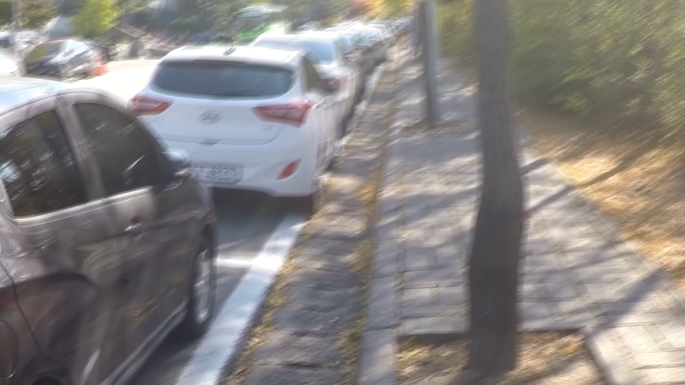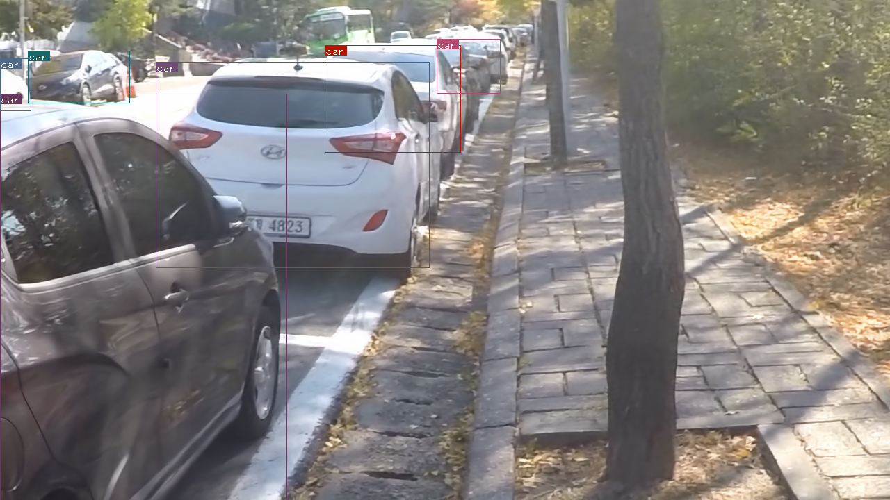
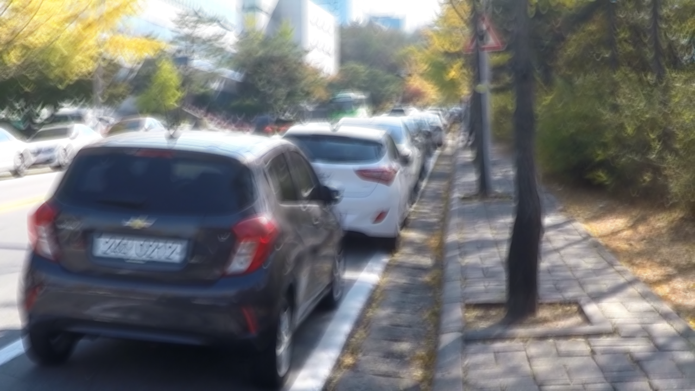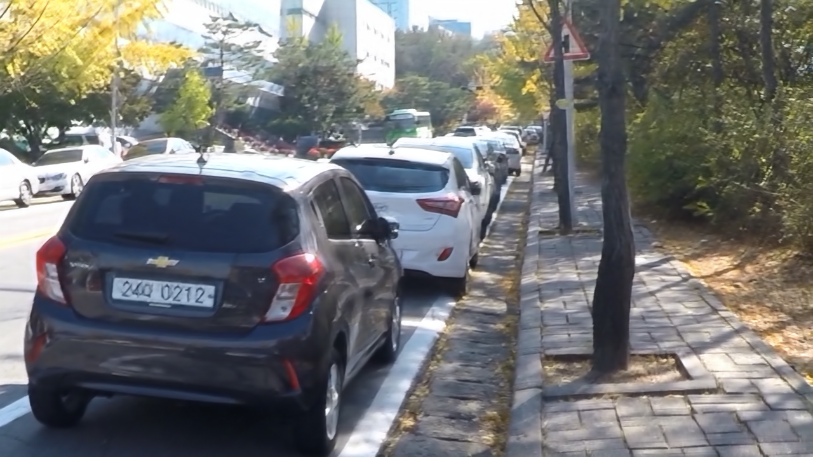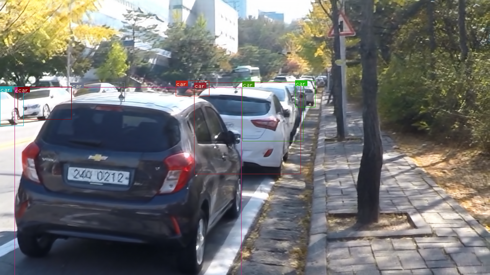
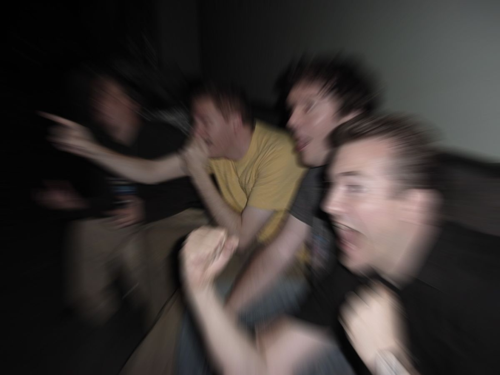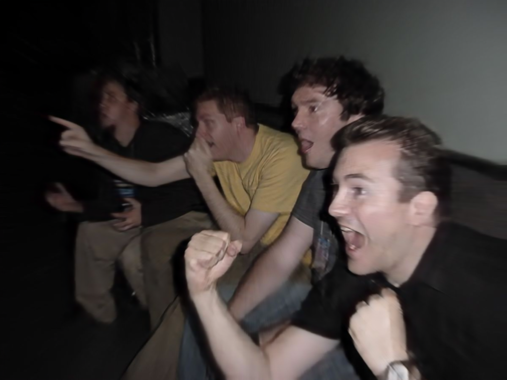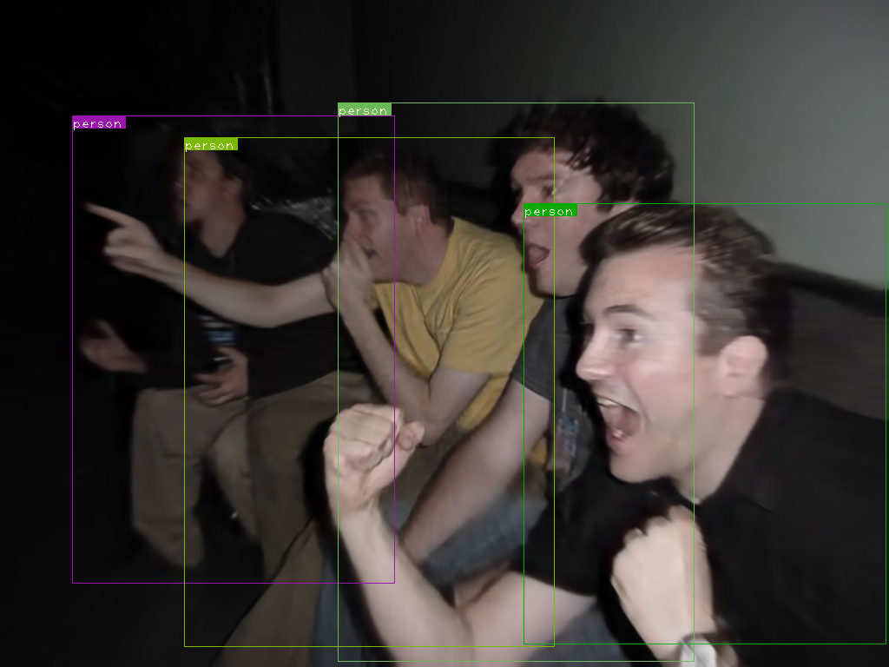
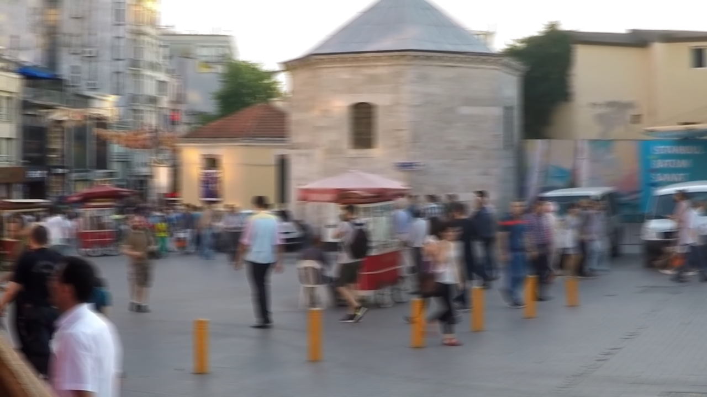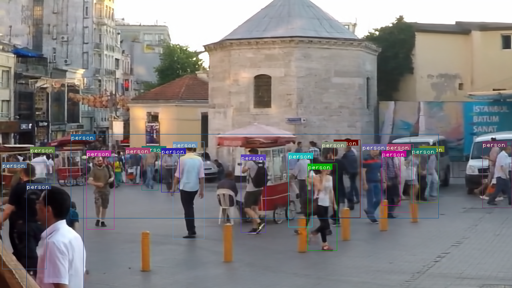
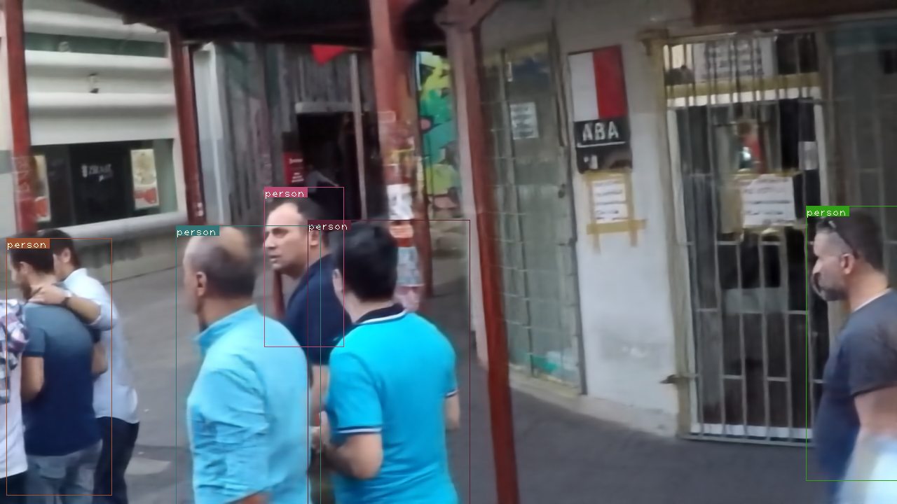
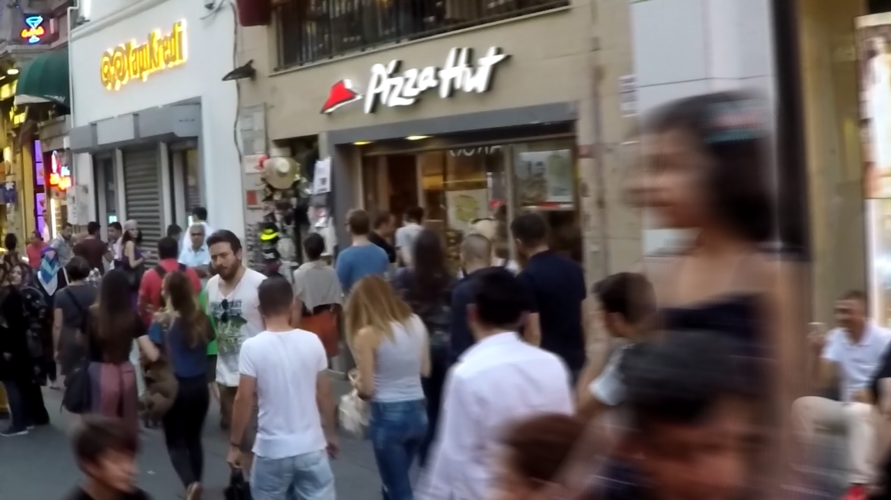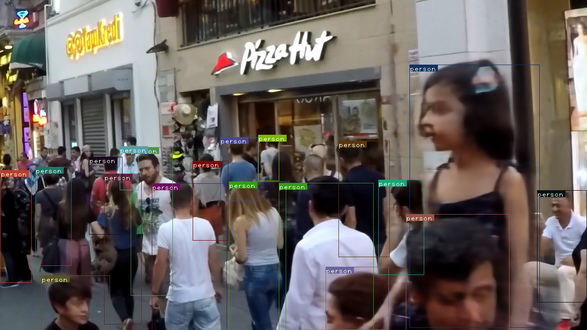

**References:**
- [DeblurGAN: Blind Motion Deblurring Using Conditional Adversarial Networks](https://arxiv.org/abs/1712.04440).
  Orest Kupyn, Volodymyr Budzan, Mykola Mykhailych, Dmytro Mishkin, Jiri Matas.
- [Generative Adversarial Networks](https://arxiv.org/abs/1406.2661).
  Ian J. Goodfellow, Jean Pouget-Abadie, Mehdi Mirza, Bing Xu, David Warde-Farley, 
  Sherjil Ozair, Aaron Courville, Yoshua Bengio.
- [YOLOv3:An Incremental Improvement](https://pjreddie.com/media/files/papers/YOLOv3.pdf).
  Joseph Redmon, Ali Farhadi.
**References:**
- [DeblurGAN: Blind Motion Deblurring Using Conditional Adversarial Networks](https://arxiv.org/abs/1712.04440).
  Orest Kupyn, Volodymyr Budzan, Mykola Mykhailych, Dmytro Mishkin, Jiri Matas.
- [Generative Adversarial Networks](https://arxiv.org/abs/1406.2661).
  Ian J. Goodfellow, Jean Pouget-Abadie, Mehdi Mirza, Bing Xu, David Warde-Farley, 
  Sherjil Ozair, Aaron Courville, Yoshua Bengio.
- [YOLOv3:An Incremental Improvement](https://pjreddie.com/media/files/papers/YOLOv3.pdf).
  Joseph Redmon, Ali Farhadi.
